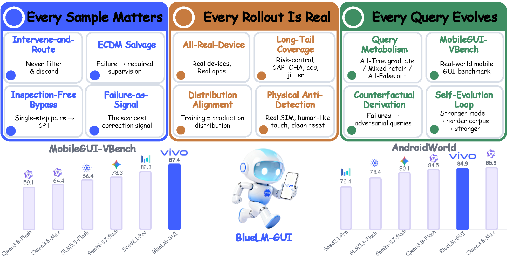

<div align="center">

<h1>BlueLM-GUI: A Real-Device-Centric Flywheel<br>for Self-Improving Mobile GUI Agents</h1>



[](https://arxiv.org/abs/2609.12394)
[](LICENSE)

**vivo AI Lab**

</div>

BlueLM-GUI is a multimodal GUI agent developed by **vivo AI Lab**, capable of understanding natural language instructions and autonomously operating mobile device interfaces to complete complex real-world tasks.

## 📰 News

- **[2026.09]** We release the technical report, benchmark datasets, and evaluation framework, alongside BlueLM-GUI achieving 87.4% on MobileGUI-VBench and 84.9% on AndroidWorld.

## 🏆 Benchmark Results

BlueLM-GUI is a lightweight yet powerful multimodal GUI agent capable of autonomous mobile interface operation. On the AndroidWorld benchmark, BlueLM-GUI delivers SOTA-competitive performance (**84.9%**) with just 3B activated parameters — closely matching top-tier industry models while offering unprecedented computational efficiency. Furthermore, it achieves state-of-the-art results on our in-house MobileGUI-VBench.

| **Model** | **Params** | **MobileGUI-VBench** | **AndroidWorld** | **Access** |
| --- | --- | --- | --- | --- |
| **BlueLM-GUI (Ours)** | 35B-A3B | **87.4** | 84.9 | In-house |
| Seed2.1-Pro | - | 82.3 | 72.4 | Closed |
| Seed2.0-Pro | - | 80.8 | 71.5 | Closed |
| Seed2.0-Lite | - | 77.5 | 71.6 | Closed |
| Gemini3.7-Flash | - | 78.3 | 80.1 | Closed |
| Claude Opus 4.8 | - | 56.9 | 63.8 | Closed |
| GLM5.3-Flash | 320B-A18B | 66.4 | 78.4 | Open |
| Qwen3.8-Max | 2.4T-A95B | 64.2 | **85.3** | Open |
| Qwen3.8-Flash | 125B-A6B | 59.1 | 84.5 | Open |
| Qwen3.8-27B | 27B | 58.0 | 81.9 | Open |
| Qwen3.7-Plus | 397B-A17B | 49.6 | 81.0 | Closed |
| Qwen3.6-35B-A3B | 35B-A3B | 40.7 | 73.3 | Open |
| Qwen3.6-27B | 27B | 64.4 | 70.3 | Open |
| Qwen3.5-122B-A10B | 122B-A10B | 57.3 | 66.4 | Open |
| Qwen3.5-35B-A3B | 35B-A3B | 42.2 | 71.1 | Open |
| Qwen3.5-27B | 27B | 53.7 | 64.2 | Open |
| GUI-Owl-1.5-32B-Think | 32B | 47.1 | 71.6 | Open |
| UI-Venus-2.0-27B | 27B | - | 84.0 | Closed |
| UI-Venus-2.0-9B | 9B | 49.6 | 80.2 | Open |
| UI-Venus-1.5-30B-A3B | 30B-A3B | 24.1 | 77.6 | Open |
| PhoneBuddy | 4B | 39.0 | 83.2 | Open |
| UI-Tars-2.0 | 230B-A23B | - | 73.3 | Closed |
| MAI-UI-235B-A22B | 235B-A22B | - | 76.7 | Closed |
| Step-GUI | 8B | - | 80.2 | Closed |

> The same table is available at [`MobileGUI-VBench/MobileGUI-VBench_table.md`](MobileGUI-VBench/MobileGUI-VBench_table.md).

## 📊 Benchmarks

This repository includes two benchmarks for evaluating mobile GUI agents:

### 1. MobileGUI-VBench (Ours)

**MobileGUI-VBench** is a comprehensive benchmark built by vivo AI Lab for evaluating mobile GUI agent capabilities. It covers **150 tasks** across **40 real-world mobile apps** and **8 scenario categories** (Social & Communication, Video Streaming, Shopping & Deals, Travel & Transit, Music & Radio, Navigation, Lifestyle Services, and News & Reading).

Key features:
- Single-app and cross-app tasks (140 single-app, 10 cross-app)
- Single-intent and multi-intent tasks with varying chain complexity (simple / medium / complex)
- Explicit, implicit, and ambiguous instruction types
- 77 distinct function points across 13 annotated dimensions

> 📄 See [MobileGUI-VBench/](MobileGUI-VBench/) for the full dataset and [documentation](MobileGUI-VBench/MobileGUI-VBench-Doc.md).

### 2. AndroidWorld (Public)

**[AndroidWorld](https://github.com/google-research/android_world)** is a public benchmark from Google Research for evaluating autonomous agents in realistic Android environments. We report results on this benchmark using the same evaluation framework to demonstrate the generalization capability of BlueLM-GUI.

> 📁 See [AndroidWorld/](AndroidWorld/) for our evaluation setup and scripts.

## 📁 Repository Structure

```
BlueLM-GUI/
├── BlueLM-GUI_technical_report.pdf          # Technical report (arXiv)
├── LICENSE                                  # Apache 2.0
├── README.md
├── assets/
│   └── overview.png                         # Overview figure (rendered)
├── MobileGUI-VBench/                        # MobileGUI-VBench benchmark dataset
│   ├── evaluation_framework.pdf             #   Evaluation framework report
│   ├── MobileGUI-VBench_table.md            #   Full benchmark comparison table
│   ├── MobileGUI-VBench.jsonl               #   Task data (JSONL format)
│   ├── MobileGUI-VBench.xlsx                #   Task data (Excel format)
│   ├── MobileGUI-VBench-Doc.html            #   Interactive documentation (English)
│   └── MobileGUI-VBench-说明文档.html        #   Interactive documentation (中文)
└── AndroidWorld/                            # AndroidWorld evaluation framework
    ├── main.py                              #   Evaluation entry point
    ├── agent.py                             #   Agent interaction logic
    ├── config.yaml                          #   Evaluation configuration
    ├── vllm_client.py                       #   vLLM API client
    ├── emulator_client.py                   #   Android emulator client
    ├── data_client.py                       #   Task data client
    ├── test_ports.py                        #   Emulator port checker
    ├── gui.md                               #   GUI action space prompt
    ├── start_vllm.sh                        #   vLLM launcher
    ├── run_eval.sh                          #   One-click evaluation script
    └── android_world/                       #   Upstream AndroidWorld source
```

## 🚀 Quick Start

### AndroidWorld Evaluation

```bash
# 1. Start vLLM service
cd AndroidWorld
bash start_vllm.sh

# 2. Run evaluation
bash run_eval.sh config.yaml
```

Prerequisites: Android emulators running on configured ports, task data API accessible, and vLLM serving the BlueLM-GUI model.

### MobileGUI-VBench

The MobileGUI-VBench dataset is available in JSONL and Excel formats under [`MobileGUI-VBench/`](MobileGUI-VBench/). Detailed documentation is provided in both [English](MobileGUI-VBench/MobileGUI-VBench-Doc.html) and [中文](MobileGUI-VBench/MobileGUI-VBench-说明文档.html), with interactive HTML versions also available.

## 📑 Citation

If you find our work useful, please cite:

```bibtex
@article{bluelm-gui,
  title   = {BlueLM-GUI Technical Report: A Real-Device-Centric Flywheel for Self-Improving Mobile GUI Agents},
  author  = {vivo AI Lab},
  journal = {arXiv preprint arXiv:2609.12394},
  year    = {2026},
  url     = {https://arxiv.org/abs/2609.12394}
}
```

## 📧 Contact

For questions or collaboration inquiries, please contact the vivo AI Lab team.

---

<p align="center">
  <sub>© 2026 vivo AI Lab. All rights reserved.</sub>
</p>